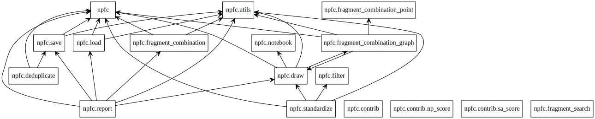

====================
Package Architecture
====================

This package is composed mostly of Python code (modules and scripts), as well
as some bash scripts and some snakemake workflows.
To give some insight about how everything holds together, figures were generated
using `pyreverse`_ and are described below.

Module interactions
********************

This package is currently composed of 15 modules. Each module is as independent
of the others as possible, but some dependency is bound to happen. To give some
insight about how everything holds together, have a look at the figure below.

Class hierarchy
***************

The figure below illustrates the class hierarchy in this package.

In your browser, use right-click and open in new tab for full screen view of this figure.

.. image:: _images/classes_npfc.svg
    :align: center

Code from other sources
***********************

While the vast majority of this repo was developed from scratch by the authors,
some  of the code in this repository was strongly inspired from other sources.
Since we did not come up with the corresponding solutions, it only seems fair to
list here the sources we could use for help.

To the original repositories and forum messages authors, we express our deepest
gratitude for saving us some serious headaches.

Classes
=======

- `HDFStore`_: create a multiprocess-safe reference file for deduplication
- `Uncharger`_: used as based for the FullUncharger class to remove all charges whenever possible
- `DepictionValidator`_: assign scores to 2D molecular-depictions to select the "best"
- np_score: object-oriented wrapper around the `npscorer`_ script (RDKit contrib)
- sa_score: object-oriented wrapper around the `sasscorer`_ script (RDKit contrib)

Functions
=========

- `idx_to_label`_: create a fragment connection point label (i.e. a, b) from the atom index (i.e. 0, 1)
- `find_symmetry_groups`_: identify equivalent atom positions in molecules

Models
======

- np_score: model from the `npscorer`_ script (RDKit contrib)
- sa_score: model from the `sasscorer`_ script (RDKit contrib)

.. _`pyreverse`: https://github.com/PyCQA/pylint
.. _`HDFStore`: https://stackoverflow.com/questions/41231678/obtaining-a-exclusive-lock-when-writing-to-an-hdf5-file
.. _`Uncharger`: https://www.rdkit.org/docs/source/rdkit.Chem.MolStandardize.rdMolStandardize.html
.. _`DepictionValidator`: https://gitlab.ebi.ac.uk/pdbe/ccdutils/blob/master/pdbeccdutils/core/depictions.py
.. _`npscorer`: https://github.com/rdkit/rdkit/blob/master/Contrib/NP_Score
.. _`sasscorer`: https://github.com/rdkit/rdkit/blob/master/Contrib/SA_Score
.. _`idx_to_label`: https://stackoverflow.com/questions/2267362/how-to-convert-an-integer-to-a-string-in-any-base
.. _`find_symmetry_groups`: https://sourceforge.net/p/rdkit/mailman/message/27897393/
