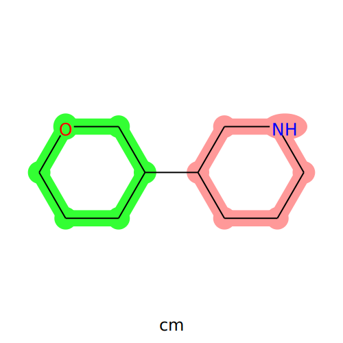
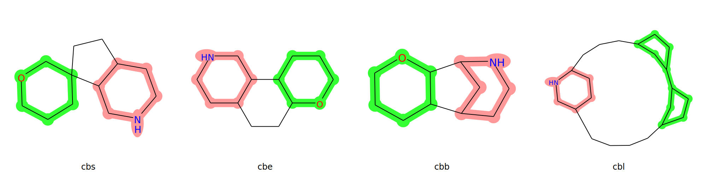
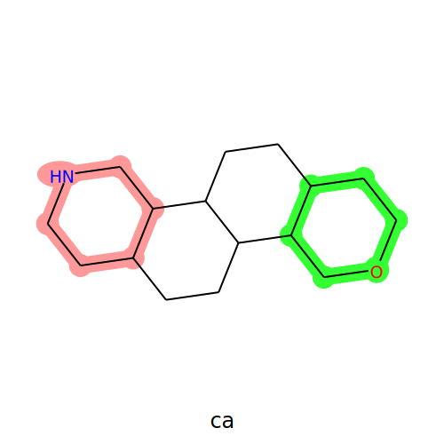

===================================
Fragment Combination Classification
===================================

Once fragments have been identified on a molecule, it is possible to systematically
investigate how these are linked together. To achieve this, a deterministic
algorithm is applied to each possible fragment pair to classify their combination.
The resulting classfication is grouped into a category, type and optionally a subtype.

Fusions
=======

The fusion category describes the presence of fused atoms, i.e. common atoms
shared by both fragments. The number of fused atoms determines the type of fusion:

- 1 fused atom in either fragments: fusion spiro (**fs**)
- 2 fused atoms in both fragments: fusion edge (**fe**)
- 3 ≤ fused atoms ≤ 5 in either fragments: fusion bridged (**fb**)
- > 5 fused atoms in either fragments: fusion linker (**fl**)

Connections
===========

When there is no fused atoms, the combination category is labeled as "connection".

Fragments can be linked together by different paths, i.e. intermediary atoms between
both fragments.

Monopodal Connections
*********************

In case there is only one path, the combination is "connection monopodal" (**cm**).

Connections of Higher Degree
****************************

Likewise, a combination with 2 possible paths to link the fragments is labelled
as "connection bipodal", and so on for 3 possible paths ("connection tripodal")
and more than 3 ("connection other"). Another way to consider this is to count
the number of intermediary rings directly located between both fragments:

- monopodal: 0 intermediary ring
- bipodal: 1 intermediary ring
- tripodal: 2 intermediary rings
- other: > 2 intermediary rings

Similar to the fusion types, a subtype is defined based on the number of fused
atoms each fragment has with each intermediary ring:

- spiro: either fragment has 1 fused atom with an intermediary ring
- edge: both fragments have 2 fused atoms with each intermediary ring
- bridged: either fragment has 3 ≤ fused atoms ≤ 5 with an intermediary ring
- linker: either fragment has > 5 fused atoms with an intermediary ring

Rings that are between both fragments but have no fused atom with either of them
are not considered to intermediary rings. A filtering is performed on intermediary
rings to discard equivalent paths and thus not overestimate the connection degree.

To break possible ties, a priority had to given to certain substypes:

    1. linker
    2. spiro
    3. bridged
    4. edge

Connections bipodal
-------------------

Connections tripodal
--------------------

Connections other
-----------------

Connections from the other type are not meant to represent thoughtful chemistry,
but rather exist as a fail-safe for the algorithm, so that a combination label
is always attributed to a pair a fragments.

Annulated Connections
*********************

Given our modelisation using paths and intermediary rings between fragments, there
is a special case of fragment combination that needs a special treatment. Indeed,
the "connection annulated" (**ca**) is a type of combination where both fragments
are linked by more than 1 path, but there is no intermediary rings either.

False Positives
===============

Some fragment combinations are not the result of an synthetic design, but rather
artefacts from this tool. These combinations are therefore labeled as false positives.

There are currently 3 types of false positives handled by the algorithm.

When fragment are too distant
*****************************

For larger molecules, some pairs of fragments are very far away to each other and
might therefore not be considered as true combinations.  For consider this, a
distance threshold of a maximum of 3 intermediary atoms between fragments was set.
This category of false positive is labeled "connection false positive cutoff (**cfc**)".

When one fragment is substructure of another
********************************************

Depending on the fragments used for the study, some fragments might be substructures
of others (i.e. a same ring with an extra methyl for one of the fragments
or a simple ring found in a double ring).

In this case, all fragment hits of the smaller fragment will be redundant with
those of the larger fragment and will not provide mucho more additional information.
For this reason, such cases are classified as "fusion false positive substructure"
(**ffs**).

When two fragments overlap
**************************

In some cases, fragments can have many fused atoms. However, this might not be
the result of synthesis design, but rather an artifact of the Fragment Search.
To identify such cases, an arbitrary rule was established as follows:
if the fused atoms between both fragments constitute a full ring in the molecule,
then it is not considered a proper fusion, but rather an overlap
(fusion false positive overlap, **ffo**).

Usage
======

Fragment combinations can be classified using the fragment_combination module:

>>> from npfc import fragment_combination
>>>
>>> # manually
>>> mol = Chem.MolFromSmiles('C1COCC2(C1)CCNCC2')
>>> frag1 = Chem.MolFromSmiles('C1CCCNC1')
>>> frag2 = Chem.MolFromSmiles('C1CCOCC1')
>>> aidxf1 =  mol.GetSubstructMatch(frag1)
>>> aidxf2 = mol.GetSubstructMatch(frag2)
>>> fcc = fragment_combination.classify(mol, aidxf1, aidxf2)

The algorithm can be applied on a DataFrame containing the Fragment Hits as well:

>>> # on a DataFrame produced by fragment_search
>>> df_fhits = load.file('fhits.csv.gz')
>>> df_fcc = fragment_combination.classify_df(df_fhits)

The DataFrame generated this way contains all the information required for
computing the fragment combination graphs (some column names are currently
hard-coded).

.. note::
    By default, exocyclic atoms in fragments are NOT considered during
    fragment combination annotation.
