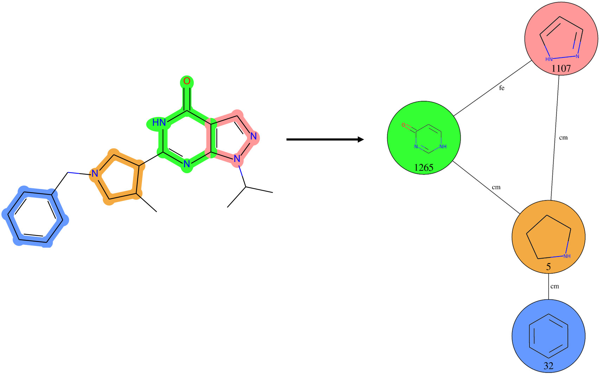

==========================
Fragment Combination Graph
==========================

The classification of fragment combination was performed on each fragment pair
individually. To represent the whole fragment connectivity of a molecule, all
corresponding fragment combinations are assembled into a fragment combination
graph, where the nodes are the fragments and the edges the combinations:

Alternative Fragment Combinations
=================================

Sometimes, it is possible for a given molecule to be represented by different
fragment combination graphs. In this case, a new row is created for each
alternative graph. A Fragment Graph ID is used for sequentially labeling
Fragment Graphs belonging to a same molecule.

****************
Independent FCGs
****************

In this case, two of more combination sets are actually independent, i.e. they
do not have any fragment combination in common, resulting in individual fragment
subgraphs. This can happen when fragments are too far apart from each other (by
default, > 3 intermediary atoms).

We considered these to be alternative graphs (but they can be considered as one
single graph as well using an option).

An example of twp independant subgraphs is illustred below:

- FCG A:

  |pic1| |pic2|

  .. |pic1| image::  _images/fcg/fcg_alt_sep_FCG_A.svg
   :width: 60%

  .. |pic2| image:: _images/fcg/fcg_alt_sep_FCG_A_fcg.png
   :width: 20%

- FCG B:

  |pic3| |pic4|

  .. |pic3| image::  _images/fcg/fcg_alt_sep_FCG_B.svg
   :width: 60%

  .. |pic4| image:: _images/fcg/fcg_alt_sep_FCG_B_fcg.png
   :width: 20%

****************
Overlapping FCGs
****************

Larger fragments containing two or more rings can sometimes overlap, resulting
in combinations of type fusion false positive overlap (**ffo**). Because these
combinations are not the result of synthesis design, but rather an artifact from
the method, they are considered false positives. To represent the resulting
different, incompatible fragment connectivies, we decided to split fragment
combinations graphs into separate alternative subgraphs.

An example of two alternative subgraphs is illustred below:

- FCG A:

  |pic5| |pic6|

  .. |pic5| image::  _images/fcg/fcg_alt_overlap_FCG_A.svg
   :width: 60%

  .. |pic6| image:: _images/fcg/fcg_alt_overlap_FCG_A_fcg.png
   :width: 20%

- FCG B:

  |pic7| |pic8|

  .. |pic7| image::  _images/fcg/fcg_alt_overlap_FCG_B.svg
   :width: 60%

  .. |pic8| image:: _images/fcg/fcg_alt_overlap_FCG_B_fcg.png
   :width: 20%

Usage
=====

Fragment combinations graphs can be generated using the
fragment_combination_graph module:

>>> from npfc import load
>>> from npfc import fragment_combination_graph
>>> df_fcc = load.file('fcc.csv.gz')  # dataframe with fragment combinations
>>> df_fcg = fragment_combination_graph.generate(df_fcc)
