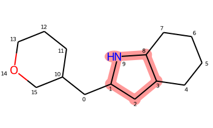

===============
Fragment Search
===============

This step consists in identifying the position of NP-fragments on the tested
molecules (NPs and synthetic compounds) by using the molecule atom indices:

The same pool of fragments has to be applied to both datasets for consistency.

This step is mostly a wrapper around RDKit functionalities to work directly on a
DataFrame with the necessary columns for post-processing.

The resulting DataFrame contains a row per Fragment Hit (i.e. fragment
occurrence):

    - idm: the id of the molecule (rowid from df_mols)
    - idf: the id of the fragment (rowid from df_frags)
    - _aidxf: the atom indices of the fragment found in the molecule
    - _fcp_labels: the fragment combination labels
    - mol_perc: the percentage of the molecule the fragment represents (based on hac)
    - mol: the molecule as RDKit Mol object
    - mol_frag: the fragment as RDKit Mol object

.. note::
    While storing the molecules and fragments as RDKit objects in separate rows
    might appear sub-optimal regarding memory usage, the RDKIt objects are
    actually **not copies but rather references** (identical object that have
    the same memory address). This means that any modification applied to either
    molecules or fragments will impact all other corresponding references in the
    DataFrame.

Usage
=====

>>> # load previously standardized molecules and fragments
>>> df_mols = load.file('mols_std.csv.gz')
>>> df_frags = load.file('frags_std.csv.gz')
>>>
>>> # row indices are used to track what fragment is found in what molecule
>>> df_mols.index = list(df_mols['idm'])
>>> df_frags.index = list(df_frags['idm'])
>>>
>>> # run the fragment search
>>> df_fs = fragment_search.get_fragment_hits(df_mols, df_frags)
