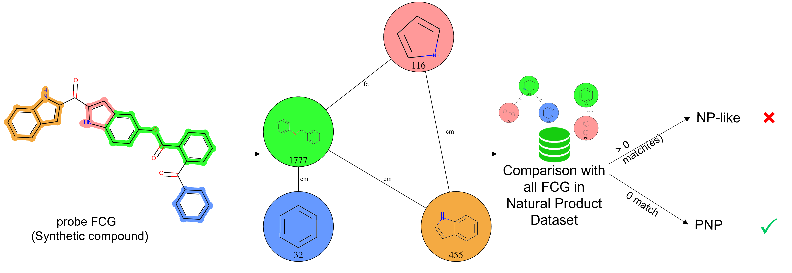

=================================
Pseudo-Natural Product Annotation
=================================

Pseudo-Natural Products (PNP) are defined as synthetic compounds,
containing Natural Product (NP) fragments arrangments not found in the Nature.

To determine whether a compound is a PNP or not (in which case it is NP-like),
its Fragment Combinatio Graph (FCG) is compared with all FCGs from the Natural
Dataset. A match is found when the whole synthetic FCG is included in any natural FCG.

For molecules whose fragment connectivity can be explained by several different FCGs (see here),
every FCG is individually compared to each natural FCG. If a molecule has at least 1 FCG with
matches, then the molecule is described as NP-like. 

Usage
=====

To identify PNPs in a dataframe with FCGs, use the following command:

>>> from npfc import load
>>> from npfc import fragment_combination_graph
>>> df_fcg = load.file('fcg.csv.gz')  # dataframe with FCGs to probe
>>> df_fcg = load.file('fcg_nat.csv.gz')  # dataframe with ref natural FCGs 
>>> # Annotate PNPs, by default, consider edge annotations, 
>>> # such as fragment- combination types (fcc) and combinaton points (fcp_1, fcp_2) 
>>> df_pnp = fragment_combination_graph.annotate_pnp(df_fcg, df_fcg_nat) 
>>> # It is possible to consider only the combination type:
>>> df_pnp = fragment_combination_graph.annotate_pnp(df_fcg, df_fcg_nat, data=['fcc']) 
