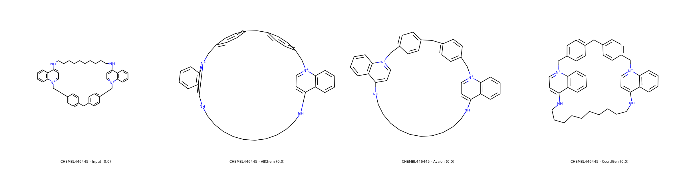
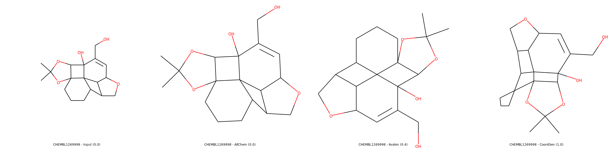
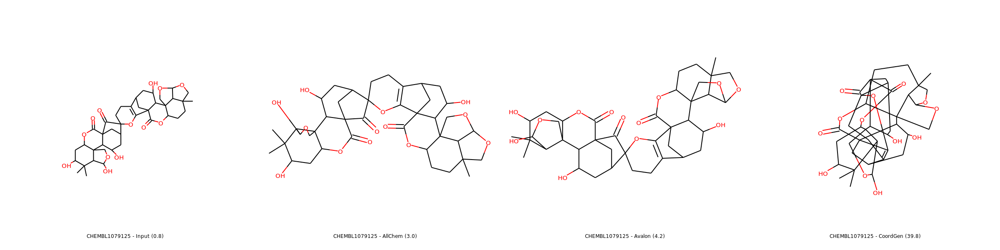

===========
Preparation
===========

This section focuses on preparing the data before analyzing fragment combinations.

****
Load
****

The load module can be used to read molecules from files into Pandas DataFrames.

>>> from npfc import load
>>>
>>> # sdf input with records title to use as identifiers
>>> df = load.file('input.sdf.gz', in_id='_Name')
>>>
>>> # csv input with the column "id" for identifiers and "smiles" for molecules
>>> df = load.file('input.csv.gz', in_id='id', in_mol='smiles', mol_format="smiles")
>>>
>>> # csv input with the column "id" for identifiers and pickled molecules in "mol"
>>> df = load.file('input.csv.gz', in_id='id', in_mol='mol', mol_format="rdkit")

The in_id parameters defines what column to use for identifying entries in the
resulting DataFrame. The out_id is the name of the column with such identifiers.
The names "mol" and "idm" are reserved names, respectively for structures in RDKit
format (encoded via pickle+base64) and the identifiers.

We recommend not to change these column names to avoid unforeseen effects.

***********
Standardize
***********

The standardization protocol is defined by a JSON configuration file.
A default protocol is used for initializing Standardizer objects without parameters.

>>> from npfc import standardize
>>>
>>> # default standardizer object
>>> standardizer = standardize.Standardizer()
>>> print(standardizer.describe())  # shows a textual diagram of the protocol

The protocol is just a dictionary that can be edited manually. The tasks are
predefined however:

- **initiate_mol**: check if the molecule passed the RDKit conversion
- **filter_empty**: filter molecules with empty structures
- **disconnect_metal**: break bonds involving metallic atoms, resulting in potentially several molecules per structure.
- **clear_mixtures**: retrieve only the "best" molecule from a mixture, which might not always be the largest one.
- **deglycosylate**: remove all external sugars-like rings from the molecule and return the remaining non-linear entity.
- **filter_num_heavy_atom**: filter molecules with a heavy atom count not in the accepted range. By default: num_heavy_atom > 3.
- **filter_molecular_weight**: filter molecules with a molecular weight not in the accepted range. By default: molecular_weight <= 1000.0.
- **filter_num_ring**: filter molecules with a number of rings (Smallest Sets of Smallest Rings or SSSR) not in the accepted range. By default: num_ring > 0.
- **filter_elements**: filter molecules with elements not considered as medchem. By default: elements in H, B, C, N, O, F, P, S, Cl, Br, I.
- **clear_isotopes**: set all atoms to their most common isotope (i.e. 14C becomes 12C which is C).
- **normalize**: always write the same functional groups in the same manner.
- **uncharge**: remove all charges on a molecule when it is possible. This is different from rdkit.Chem.MolStandardize.charge module as there is no attempt for reaching the zwitterion.
- **canonicalize**: enumerate the canonical tautomer.
- **clear_stereo**: remove all remaining stereochemistry flags on the molecule.
- **reset_mol**: convert forth and back to SMILES format to discard potential residual outdated flags on atoms and bonds.
- **depict**: find the "best" possible 2D depiction of the molecule among Input/rdDepictor/Avalon/CoordGen methods.
- **extract_murcko**: return the Murcko Scaffold from the molecule.
- **clear_side_chains**: remove any exocyclic atom that is not part of a linker.
- **reset_mol**: reset the molecule by converting to and then from smiles.

To apply the standardization protocol, type the commands below. Note that the
molecule is modified in place. When applied on a molecule, three values are returned:

- mol: the standardized molecule
- status: either passed, filtered or error
- latest_task: the name of the latest task applied on molecule, or "standardize" if all completed.

>>> # apply on a single molecule
>>> from rdkit import Chem
>>> mol = Chem.MolFromSmiles('c1ccccc1')
>>> mol, status, latest_task = s.run(mol)  # retuns a tuple

When working on a DataFrame, molecules which were filtered or raised errors are
automatically returned in different DataFrames.

>>> # to apply on molecules in a DataFrame
>>> df_passed, df_filtered, df_error = s.run_df(df)  # returns a tuple

***********
Deduplicate
***********

After standardization, some molecules might now have the same structure. Therefore,
they constitute duplicate entries and can be removed without losing much information
in the results.

For identifying unique molecules, the InChI Key is used. If the column "inchikey"
is already present in the provided DataFrame, it will be used, otherwise it will
be computed automatically.

The removal of duplicate structures occurs in two steps:

1) all duplicate structures are identified within the DataFrame
2) if available, structures in the DataFrame are compared to a reference file,
   which contains the inchikey and the id of already passed molecules.
   All molecules with InChI Keys that are already present in the reference file
   are removed as well, ensuring only unique molecules are postprocessed.
   A lock system is applied on the reference file so that only one process can
   access it (read and write) at the same time.

>>> from npfc import deduplicate
>>>
>>> # remove all duplicates without a reference file
>>> df_filtered = deduplicate.filter_duplicates(df)
>>>
>>> # remove all duplicates using a HDF5 reference file
>>> # (ref file gets updated with all passed molecules)
>>> df_filtered = deduplicate.filter_duplicates(df, ref_file='data_ref.hdf')

******
Depict
******

Depicting molecules with the best illustration is not as trivial as it sounds like.
To our knowledge, there is not a single tool that could represent all types of
structures with high quality depiction, so compromises have to be made.

In this package, a set of 2D-coordinates is generated for each molecule, then
these are scored using a third-party tool (`DepictionValidator`_), and finally
the best performing depiction is selected.

>>> from draw import depict_mol
>>> mol = depict_mol(mol)

Currently, three methods are applied in a given order:

1. CoordGen
2. rdDepictor (AllChem)
3. Avalon

If a depiction yields a perfect score (0), then the other methods are not applied.
When none of the methods returns a perfect score, the depiction with the lowest
score is selected. If the molecule already contained 2D coordinates, these might
be used as well ("input" method).

Examples of 2D coordinates computed with listed methods (source: SDF from ChEMBL).
Use right click and open in new tab for enlarged images.

- Simple case

Most of molecules including macrocycles are usually better rendered with CoordGen.

- Medium case

In same cases, Avalon performs better than CoordGen.

- Complex Case

Sometimes, no depiction is really good, so the "less worse" one is selected.

.. note:: For CoordGen, 2D representations are automatically rescaled with a factor of 1.4.

.. warning:: Avalon is disabled from the available methods as in our tests it produces mostly errors since latest RDKit update...

.. _`DepictionValidator`: https://gitlab.ebi.ac.uk/pdbe/ccdutils/blob/master/pdbeccdutils/core/depictions.py
