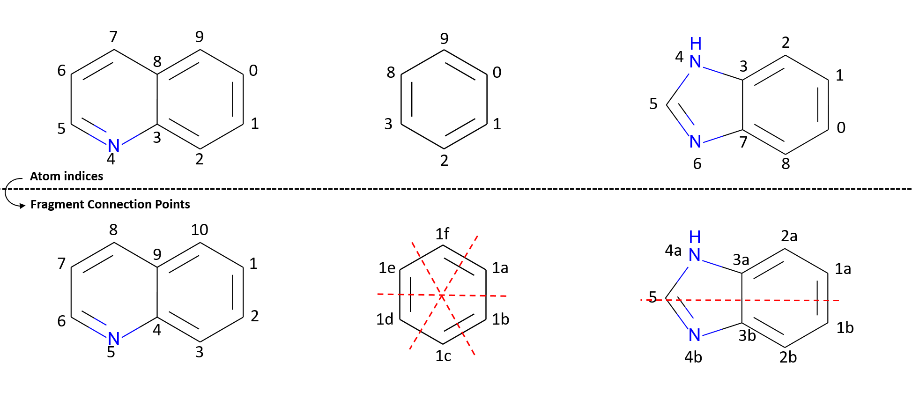

**************************
fragment_combination_point
**************************

This module was developed to label atom indices while considering symmetry.

.. warning:: The numbering begins at 1 instead of 0.

|pic1|

Usage
=====

>>> from rdkit import Chem
>>> from npfc import fragment_combination_point

.. automodule:: npfc.fragment_combination_point
    :members:
