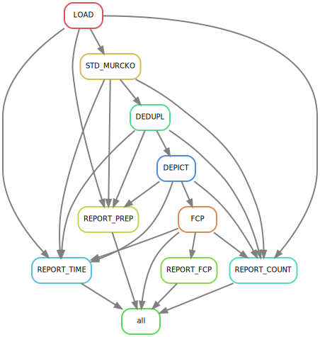

=========
Fragments
=========

This package contains a number of commands that can be used directly. However, to gain in organization and reproducibility, snakemake workflows were developped to
coordinate the jobs.

************
The workflow
************

The "fragments" workflow consists in processing a molecular file to generate fragments to use for fragment (substructure) search in natural and synthetic datasets.

It can be described in 3 major steps:

    1. Preparation
        - Load the input molecular file
        - Standardize the structures and extract the Murcko scaffolds
        - Deduplicate the entries using InChI Key
        - Depict the molecules in 2D
    2. Annotate Fragment Combination Points (FCP) on structures
    3. Report results

The standardization protocol in this workflow applied is specific to the fragments, whereas the same protocol should be applied to natural and synthetic datasets. 

A visualization of the task tree is automatically generated when running the run_protocol_fc script:

Snakemake was chosen for this project. The snakemake file, containing the workflow rules, is included in the npfc package.

********************
Running the workflow
********************

Two configuration and one molecular file should be provided to run the workflow:

    - :download:`workflow <_data/test_fragments_crms.json>`
    - :download:`standardization protocol <_data/test_fragments_crms_std.json>`
    - :download:`raw molecular file <_data/cr_test.sdf.gz>`

The standardization protocol has to be specified within the workflow configuration file.

To run the fragments workflow, run the following command:

>>> run_protocol_fc fragments -c fc/01_fragments/crms/test_fragments_crms.json > fc/01_fragments/crms/test_fragments_crms.log 2>&1  # run the wf and save the log

.. note:: The provided configuration files and the command above are extracted from the automated tests. See below for the tree folder to follow.

The protocol "fragments" is included within the npfc package. 
In case you want to edit to suit your needs, within reason, you can still use the same command:

>>> run_protocol_fc my/own/fragments/file.smk -c fc/01_fragments/crms/test_fragments_crms.json > fc/01_fragments/crms/test_fragments_crms.log 2>&1  # run the wf and save the log

***********
Folder tree
***********

To make things better organized, tasks will create data, log and report subdirectories.

Here is an annotated folder tree I used for a dataset named crms:

::

    fc  # fc for fragment combination, but basically just the ROOT folder
    ├── 01_fragments
    │   └── crms
    │       ├── data
    │       │   ├── 00_raw  
    │       │   │   └── data  
    │       │   │       └── cr_test.sdf.gz  # put the raw input file here 
    │       │   └── prep
    │       │       ├── 01_load
    │       │       │   ├── data
    │       │       │   │   └── crms.csv.gz
    │       │       │   └── log
    │       │       │       └── crms.log
    │       │       ├── 02_std
    │       │       │   ├── data
    │       │       │   │   └── crms_std.csv.gz
    │       │       │   └── log
    │       │       │       ├── crms_error.csv.gz
    │       │       │       ├── crms_filtered.csv.gz
    │       │       │       └── crms_std.log
    │       │       ├── 03_dedupl
    │       │       │   ├── crms_ref.hdf
    │       │       │   ├── data
    │       │       │   │   └── crms_dedupl.csv.gz
    │       │       │   └── log
    │       │       │       ├── crms_dedupl.log
    │       │       │       ├── crms_filtered.csv.gz
    │       │       │       └── crms_synonyms.csv.gz
    │       │       ├── 04_depict
    │       │       │   ├── data
    │       │       │   │   └── crms_depict.csv.gz
    │       │       │   └── log
    │       │       │       └── crms_depict.log
    │       │       ├── 05_fcp  # specific to fragments
    │       │       │   ├── data
    │       │       │   │   └── crms_fcp.csv.gz
    │       │       │   └── log
    │       │       │       ├── crms_fcp.log
    │       │       │       └── crms_fcp_symcounts.csv
    │       │       └── report
    │       │           ├── data
    │       │           │   ├── crms_count_mols.csv
    │       │           │   ├── crms_fcp_nsymgroups.csv
    │       │           │   ├── crms_prep_error.csv
    │       │           │   ├── crms_prep_filtered.csv
    │       │           │   ├── crms_prep_overview.csv
    │       │           │   └── crms_time.csv
    │       │           ├── log
    │       │           │   ├── crms_count_mols.log
    │       │           │   ├── crms_time.log
    │       │           │   ├── report_fcp_crms.log
    │       │           │   └── report_prep_crms.log
    │       │           ├── plot
    │       │           │   ├── crms_fcp_nsymgroups.svg
    │       │           │   ├── crms_prep_error.svg
    │       │           │   ├── crms_prep_filtered.svg
    │       │           │   └── crms_prep_overview.svg
    │       │           ├── report_fcp_crms.log
    │       │           └── report_prep_crms.log
    │       ├── fragments_crms_tasktree.svg
    │       ├── test_fragments_crms.json  # put the workflow configuration file here
    │       ├── test_fragments_crms.log
    │       └── test_fragments_crms_std.json  # put the standardization protocol file here

.. warning:: It is strongly recommended to use the same layout for the raw input file and the configuration files. Things might break otherwise, due to the work being orchestrated with a snakemake workflow.

Using this tree folder, one can have several prep subfolders (i.e. prep, prep2, etc.) without having to copy the raw input molecular file. 