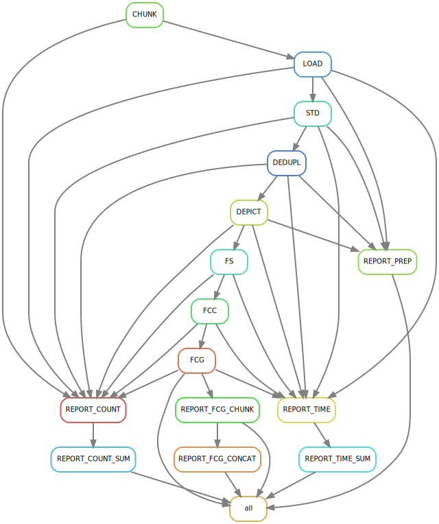

=========
Fragments
=========

The "fragments" workflow consists in processing a molecular file to generate fragments to use for fragment (substructure) search in natural and synthetic datasets.

example config file json
svg of the workflow