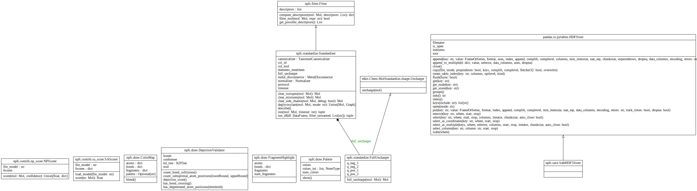

.. npfc documentation master file, created by
   sphinx-quickstart on Mon Feb 11 10:18:59 2019.
   You can adapt this file completely to your liking, but it should at least
   contain the root `toctree` directive.

Welcome to npfc's documentation!
================================

The library is used for the analysis of Natural-Product Fragment Combination (npfc).

It is based on the RDKit.

More documentation will be produced over time, for now only module descriptions are
available. Please have a look and enjoy, any feedback is welcome!

.. toctree::
   :maxdepth: 2
   :caption: Contents:

   load
   save
   filter
   standardize
   fragment
   utils
   draw

Indices and tables
==================

* :ref:`genindex`
* :ref:`modindex`
* :ref:`search`

Package Architecture
====================

Module interactions:

.. image:: _images/packages_npfc.svg
    :align: center

class hierarchy:

