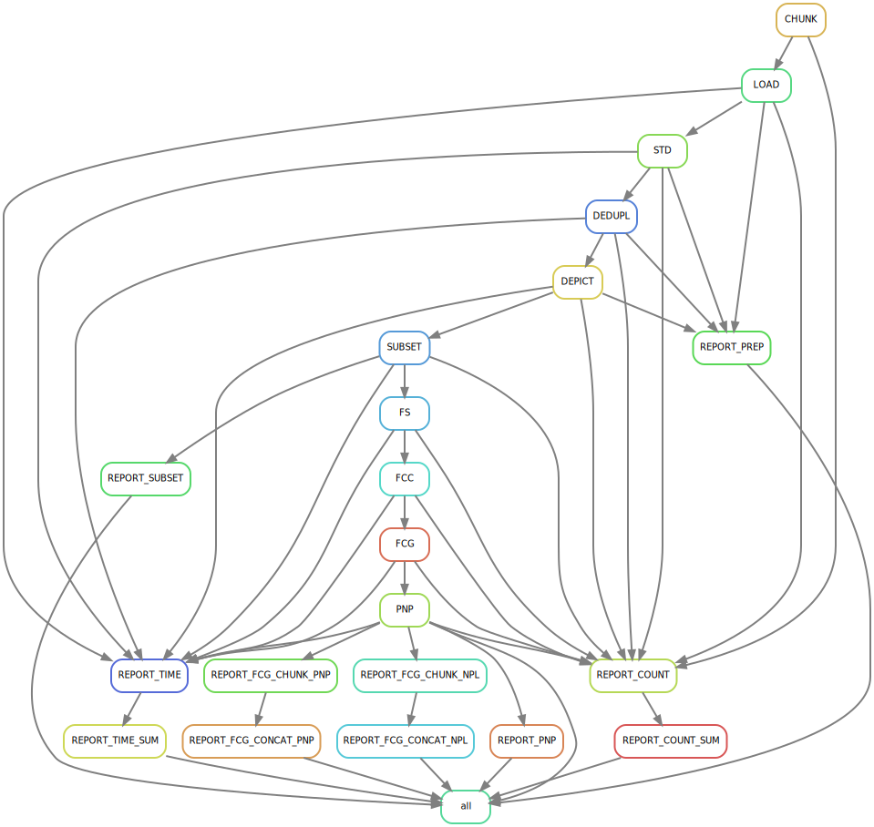

===================
Synthetic Compounds
===================

************
The workflow
************

The synthetic workflow is the most complex of the three. As for natural products, structures first need to be prepared.
However, any natural product should be removed from this dataset, so a subset task is carried out before the fragment search.
Moreover, once FCG are computed, they are compared with the FCGs in the natural dataset to identify any potential Pseudo-NP (PNP).

The tasks can thus be described in 7 main steps:

    1. Preparation (Chunk, Load, Standardize, Deduplicate, Depict)
    2. Subset
    3. Fragment Search (FS)
    4. Fragment Combination Classification (FCC)
    5. Fragment Combination Graph (FCG) 
    6. PNP Annotation (PNP)
    7. Reporting

********************
Running the workflow
********************

As for the other workflows, two configuration files and a moleculare file are required:

    - :download:`workflow configuration <_data/test_synthetic_chembl_natrefdnp_fragscrms.json>`
    - :download:`standardization protocol <_data/test_synthetic_chembl_std.json>`
    - :download:`raw molecular file <_data/coconut_test.sdf.gz>`

The synthetic compound workflow can be run using the following command:

>>> run_protocol_fc synthetic -c fc/04_synthetic/chembl/test_synthetic_chembl_natrefdnp_fragscrms.json > fc/04_synthetic/chembl/test_synthetic_chembl_natrefdnp_fragscrms.log 2>&1

The task tree below illustrates the workflow's logic:

***********
Folder tree
***********

In total, there are 4 main levels in the folder tree: raw, prep, subset and frags, resulting in the following folder tree:

::

    fc
    ├── 01_fragments
    ├── 03_natural
    └── 04_synthetic
        └── chembl
            ├── data
            │   ├── 00_raw
            │   │   └── data
            │   │       ├── chembl_act.csv.gz
            │   │       ├── chembl_num_mols.json
            │   │       ├── chembl_test.sdf.gz
            │   │       └── chembl_test.sdf.gz.bk
            │   └── prep
            │       ├── 01_chunk
            │       │   ├── data
            │       │   │   ├── chembl_001.sdf.gz
            │       │   │   └── chembl_002.sdf.gz
            │       │   └── log
            │       │       └── chembl_chunk.log
            │       ├── 02_load
            │       │   ├── data
            │       │   │   ├── chembl_001.csv.gz
            │       │   │   └── chembl_002.csv.gz
            │       │   └── log
            │       │       ├── chembl_001_load.log
            │       │       └── chembl_002_load.log
            │       ├── 03_std
            │       │   ├── data
            │       │   │   ├── chembl_001_std.csv.gz
            │       │   │   └── chembl_002_std.csv.gz
            │       │   └── log
            │       │       ├── chembl_001_error.csv.gz
            │       │       ├── chembl_001_filtered.csv.gz
            │       │       ├── chembl_001_std.log
            │       │       ├── chembl_002_error.csv.gz
            │       │       ├── chembl_002_filtered.csv.gz
            │       │       └── chembl_002_std.log
            │       ├── 04_dedupl
            │       │   ├── chembl_ref.hdf
            │       │   ├── data
            │       │   │   ├── chembl_001_dedupl.csv.gz
            │       │   │   └── chembl_002_dedupl.csv.gz
            │       │   └── log
            │       │       ├── chembl_001_dedupl.log
            │       │       ├── chembl_001_filtered.csv.gz
            │       │       ├── chembl_001_synonyms.csv.gz
            │       │       ├── chembl_002_dedupl.log
            │       │       ├── chembl_002_filtered.csv.gz
            │       │       └── chembl_002_synonyms.csv.gz
            │       ├── 05_depict
            │       │   ├── data
            │       │   │   ├── chembl_001_depict.csv.gz
            │       │   │   └── chembl_002_depict.csv.gz
            │       │   └── log
            │       │       ├── chembl_001_depict.log
            │       │       └── chembl_002_depict.log
            │       ├── natref_coconut
            │       │   ├── 06_subset
            │       │   │   ├── data
            │       │   │   │   ├── chembl_001_subset.csv.gz
            │       │   │   │   └── chembl_002_subset.csv.gz
            │       │   │   └── log
            │       │   │       ├── chembl_001_subset.log
            │       │   │       └── chembl_002_subset.log
            │       │   ├── frags_crms
            │       │   │   ├── 07_fs
            │       │   │   │   ├── data
            │       │   │   │   │   ├── chembl_001_fs.csv.gz
            │       │   │   │   │   └── chembl_002_fs.csv.gz
            │       │   │   │   └── log
            │       │   │   │       ├── chembl_001_fs.log
            │       │   │   │       └── chembl_002_fs.log
            │       │   │   ├── 08_fcc
            │       │   │   │   ├── data
            │       │   │   │   │   ├── chembl_001_fcc.csv.gz
            │       │   │   │   │   └── chembl_002_fcc.csv.gz
            │       │   │   │   └── log
            │       │   │   │       ├── chembl_001_fcc.log
            │       │   │   │       └── chembl_002_fcc.log
            │       │   │   ├── 09_fcg
            │       │   │   │   ├── data
            │       │   │   │   │   ├── chembl_001_fcg.csv.gz
            │       │   │   │   │   └── chembl_002_fcg.csv.gz
            │       │   │   │   └── log
            │       │   │   │       ├── chembl_001_fcg.log
            │       │   │   │       └── chembl_002_fcg.log
            │       │   │   ├── 10_pnp
            │       │   │   │   ├── data
            │       │   │   │   │   ├── chembl_001_npl.csv.gz
            │       │   │   │   │   ├── chembl_001_pnp.csv.gz
            │       │   │   │   │   ├── chembl_002_npl.csv.gz
            │       │   │   │   │   └── chembl_002_pnp.csv.gz
            │       │   │   │   └── log
            │       │   │   │       ├── chembl_001_list_pnp.csv.gz
            │       │   │   │       ├── chembl_001_pnp.log
            │       │   │   │       ├── chembl_002_list_pnp.csv.gz
            │       │   │   │       └── chembl_002_pnp.log
            │       │   │   └── report
            │       │   │       ├── data
            │       │   │       │   ├── 10_pnp
            │       │   │       │   │   ├── npl
            │       │   │       │   │   │   ├── chembl_001_npl_counts.csv
            │       │   │       │   │   │   ├── chembl_001_npl_fcc.csv
            │       │   │       │   │   │   ├── chembl_001_npl_fc.csv
            │       │   │       │   │   │   ├── chembl_001_npl_fragratio.csv
            │       │   │       │   │   │   ├── chembl_001_npl_nfcgpermol.csv
            │       │   │       │   │   │   ├── chembl_001_npl_nhits.csv
            │       │   │       │   │   │   ├── chembl_001_npl_nhits_u.csv
            │       │   │       │   │   │   ├── chembl_001_npl_topfrags.csv
            │       │   │       │   │   │   ├── chembl_001_npl_topfrags_u.csv
            │       │   │       │   │   │   ├── chembl_002_npl_counts.csv
            │       │   │       │   │   │   ├── chembl_002_npl_fcc.csv
            │       │   │       │   │   │   ├── chembl_002_npl_fc.csv
            │       │   │       │   │   │   ├── chembl_002_npl_fragratio.csv
            │       │   │       │   │   │   ├── chembl_002_npl_nfcgpermol.csv
            │       │   │       │   │   │   ├── chembl_002_npl_nhits.csv
            │       │   │       │   │   │   ├── chembl_002_npl_nhits_u.csv
            │       │   │       │   │   │   ├── chembl_002_npl_topfrags.csv
            │       │   │       │   │   │   └── chembl_002_npl_topfrags_u.csv
            │       │   │       │   │   └── pnp
            │       │   │       │   │       ├── chembl_001_pnp_counts.csv
            │       │   │       │   │       ├── chembl_001_pnp_fcc.csv
            │       │   │       │   │       ├── chembl_001_pnp_fc.csv
            │       │   │       │   │       ├── chembl_001_pnp_fragratio.csv
            │       │   │       │   │       ├── chembl_001_pnp_nfcgpermol.csv
            │       │   │       │   │       ├── chembl_001_pnp_nhits.csv
            │       │   │       │   │       ├── chembl_001_pnp_nhits_u.csv
            │       │   │       │   │       ├── chembl_001_pnp_topfrags.csv
            │       │   │       │   │       ├── chembl_001_pnp_topfrags_u.csv
            │       │   │       │   │       ├── chembl_002_pnp_counts.csv
            │       │   │       │   │       ├── chembl_002_pnp_fcc.csv
            │       │   │       │   │       ├── chembl_002_pnp_fc.csv
            │       │   │       │   │       ├── chembl_002_pnp_fragratio.csv
            │       │   │       │   │       ├── chembl_002_pnp_nfcgpermol.csv
            │       │   │       │   │       ├── chembl_002_pnp_nhits.csv
            │       │   │       │   │       ├── chembl_002_pnp_nhits_u.csv
            │       │   │       │   │       ├── chembl_002_pnp_topfrags.csv
            │       │   │       │   │       └── chembl_002_pnp_topfrags_u.csv
            │       │   │       │   ├── chembl_count_mols.csv
            │       │   │       │   ├── chembl_fcg_npl_fcc.csv
            │       │   │       │   ├── chembl_fcg_npl_fc.csv
            │       │   │       │   ├── chembl_fcg_npl_fragmolcov.csv
            │       │   │       │   ├── chembl_fcg_npl_nfcgpermol.csv
            │       │   │       │   ├── chembl_fcg_npl_nhits.csv
            │       │   │       │   ├── chembl_fcg_npl_nhits_u.csv
            │       │   │       │   ├── chembl_fcg_npl_top10frags.csv
            │       │   │       │   ├── chembl_fcg_npl_top10frags_u.csv
            │       │   │       │   ├── chembl_fcg_pnp_fcc.csv
            │       │   │       │   ├── chembl_fcg_pnp_fc.csv
            │       │   │       │   ├── chembl_fcg_pnp_fragmolcov.csv
            │       │   │       │   ├── chembl_fcg_pnp_nfcgpermol.csv
            │       │   │       │   ├── chembl_fcg_pnp_nhits.csv
            │       │   │       │   ├── chembl_fcg_pnp_nhits_u.csv
            │       │   │       │   ├── chembl_fcg_pnp_top10frags.csv
            │       │   │       │   ├── chembl_fcg_pnp_top10frags_u.csv
            │       │   │       │   ├── chembl_pnp_numnpfcgrefpernpl.csv
            │       │   │       │   ├── chembl_pnp_ratio.csv
            │       │   │       │   └── chembl_time.csv
            │       │   │       ├── log
            │       │   │       │   ├── 10_pnp
            │       │   │       │   │   ├── npl
            │       │   │       │   │   │   ├── report_fcg_chembl_001_pnp.log
            │       │   │       │   │   │   └── report_fcg_chembl_002_pnp.log
            │       │   │       │   │   └── pnp
            │       │   │       │   │       ├── report_fcg_chembl_001_pnp.log
            │       │   │       │   │       └── report_fcg_chembl_002_pnp.log
            │       │   │       │   ├── chembl_001_count_mols.log
            │       │   │       │   ├── chembl_001_time.log
            │       │   │       │   ├── chembl_002_count_mols.log
            │       │   │       │   ├── chembl_002_time.log
            │       │   │       │   ├── report_fcg_chembl_npl.log
            │       │   │       │   ├── report_fcg_chembl_pnp.log
            │       │   │       │   └── report_pnp_chembl.log
            │       │   │       ├── plot
            │       │   │       │   ├── chembl_fcg_npl_fcc.svg
            │       │   │       │   ├── chembl_fcg_npl_fc.svg
            │       │   │       │   ├── chembl_fcg_npl_fragmolcov.svg
            │       │   │       │   ├── chembl_fcg_npl_fragmolcov._zoom.svg
            │       │   │       │   ├── chembl_fcg_npl_nfcgpermol.svg
            │       │   │       │   ├── chembl_fcg_npl_nhits.svg
            │       │   │       │   ├── chembl_fcg_npl_nhits._zoom.svg
            │       │   │       │   ├── chembl_fcg_npl_top10frags.svg
            │       │   │       │   ├── chembl_fcg_npl_top10frags_u.svg
            │       │   │       │   ├── chembl_fcg_pnp_fcc.svg
            │       │   │       │   ├── chembl_fcg_pnp_fc.svg
            │       │   │       │   ├── chembl_fcg_pnp_fragmolcov.svg
            │       │   │       │   ├── chembl_fcg_pnp_fragmolcov._zoom.svg
            │       │   │       │   ├── chembl_fcg_pnp_nfcgpermol.svg
            │       │   │       │   ├── chembl_fcg_pnp_nhits.svg
            │       │   │       │   ├── chembl_fcg_pnp_nhits._zoom.svg
            │       │   │       │   ├── chembl_fcg_pnp_top10frags.svg
            │       │   │       │   ├── chembl_fcg_pnp_top10frags_u.svg
            │       │   │       │   ├── chembl_pnp_numnpfcgrefpernpl.svg
            │       │   │       │   └── chembl_pnp_ratio.svg
            │       │   │       ├── report_fcg_chembl.log
            │       │   │       └── report_pnpannotation_chembl.log
            │       │   └── report
            │       │       ├── data
            │       │       │   └── chembl_subset_subset.csv
            │       │       ├── log
            │       │       │   └── report_subset_chembl.log
            │       │       ├── plot
            │       │       │   └── chembl_subset_subset.svg
            │       │       └── report_subset_chembl.log
            │       └── report
            │           ├── data
            │           │   ├── chembl_prep_error.csv
            │           │   ├── chembl_prep_filtered.csv
            │           │   └── chembl_prep_overview.csv
            │           ├── plot
            │           │   ├── chembl_prep_error.svg
            │           │   ├── chembl_prep_filtered.svg
            │           │   └── chembl_prep_overview.svg
            │           └── report_prep_chembl.log
            ├── synthetic_chembl_tasktree.svg
            ├── test_synthetic_chembl_natrefdnp_fragscrms.json
            ├── test_synthetic_chembl_natrefdnp_fragscrms.log
            └── test_synthetic_chembl_std.json